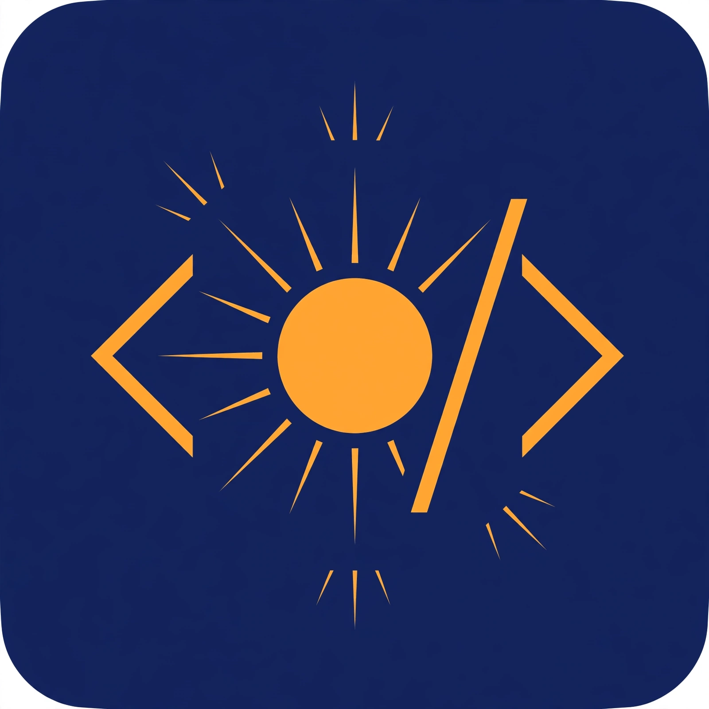

<p align="center">
  
</p>

# Sunday — The Agent-First Coding IDE

> **Your AI pair programmer, built into your editor.** Sunday is a VS Code-based IDE with a built-in autonomous coding agent — not a chatbot bolted on, but an agent-first development environment.

[](LICENSE)
[](https://github.com/Vivek492005/Sunday/releases)
[](https://github.com/Vivek492005/Sunday/actions)

---

## What is Sunday?

Sunday takes the editor you already know — VS Code — and rebuilds it around an **autonomous coding agent**. Instead of copying code from a chat window, you describe what you want and Sunday's agent:

1. **Plans** the change (breaking it into steps)
2. **Reads** your codebase (with semantic context retrieval)
3. **Edits** files (with diff review before anything is applied)
4. **Runs** terminal commands (with your approval)
5. **Verifies** the result (with a built-in verifier agent)
6. **Checkpoints** everything (shadow-git lets you undo any hunk)

### How it works

```
┌─────────────────────────────────────────────────────────────┐
│                    Sunday IDE (VS Code fork)                │
│  ┌──────────────┐  ┌──────────────┐  ┌──────────────────┐  │
│  │  Chat View   │  │ Agent Manager│  │  Agent Browser   │  │
│  │  (ui-chat)   │  │ (ui-manager) │  │   (live view)    │  │
│  └──────┬───────┘  └──────┬───────┘  └────────┬─────────┘  │
│         └────────────────┼───────────────────┘            │
│              sunday-agent extension (ext-agent)             │
└──────────────────────────┼──────────────────────────────────┘
                           │ JSON-RPC (NDJSON)
                           ▼
┌─────────────────────────────────────────────────────────────┐
│              sundayd — per-user daemon (sundayd)             │
│  ┌──────────┐ ┌──────────┐ ┌──────────┐ ┌────────────────┐  │
│  │ Sessions │ │ Agent    │ │ Policy   │ │ Orchestrator   │  │
│  │          │ │ Loop     │ │ Gate     │ │ (multi-agent)  │  │
│  └──────────┘ └──────────┘ └──────────┘ └────────────────┘  │
│  ┌──────────┐ ┌──────────┐ ┌──────────┐ ┌────────────────┐  │
│  │ Tools    │ │ Context  │ │ MCP Hub  │ │ Checkpoints    │  │
│  │ (fs,git, │ │ (TF-IDF  │ │ Skills   │ │ (shadow-git)   │  │
│  │ terminal)│ │ retrieval)│ │          │ │                │  │
│  └──────────┘ └──────────┘ └──────────┘ └────────────────┘  │
└──────────────────────────┼──────────────────────────────────┘
                           │ HTTPS
                           ▼
┌─────────────────────────────────────────────────────────────┐
│           Gateway — provider router (gateway)               │
│     OpenRouter ◄──► Groq  │  Relay fallback on 429/quota   │
└─────────────────────────────────────────────────────────────┘
```

**Key design principles:**
- **API-first, no local model loading** — uses OpenRouter + Groq (free tiers available); your machine stays light
- **One daemon per user** — shared socket, single-flight startup, per-workspace isolation
- **Fail-closed security** — untrusted workspaces get restricted tools, secrets never leave your machine unredacted
- **Visible Relay** — when a provider rate-limits, you see exactly what happened and it auto-resumes

---

## ✨ Features

### 🤖 Autonomous Agent
- **Multi-step task execution** — describe a feature, the agent plans, codes, and verifies
- **Hierarchical orchestration** — Orchestrator breaks work into parallel units → Feature Agents execute → Verifier checks (max 8 units, overlap detection, budget enforcement)
- **Background agents** — detached runs that survive editor close, deliver results as GitHub PRs *(experimental)*
- **Checkpointing** — shadow-git gives hunk-level undo for every agent change

### 🧠 Editor Intelligence
- **Ghost-text autocomplete** — Tab to accept, powered by fast/cheap models
- **Inline edit** (`Ctrl+I`) — select code, describe the change, review the diff
- **Code actions** — Fix, Explain, Generate Tests
- **Smart mentions** — `@file`, `@folder`, `@symbol`, `@selection`, `@terminal`, `@diagnostics`, `@git-diff`, `@web`, `@docs`
- **Next-edit suggestions** — after a rename, offers the next occurrence as CodeLens *(experimental)*
- **Commit message generation** — from your staged diff

### 🌐 Agent Browser
- **Live browser view** — watch the agent browse (2fps screencast)
- **Takeover mode** — grab control mid-task, hand it back when done
- **13 `browser_*` tools** — navigation, snapshots, console, screenshots, walkthroughs
- **Policy-gated** — `file://` and private IPs blocked, new origins need approval

### 🗣️ Voice *(experimental)*
- **Voice input** — speak your prompt via Web Speech API
- **Voice output** — hear responses via speech synthesis
- **Privacy-first** — no audio touches Sunday servers; text is reviewed before sending

### 💻 Multiple Frontends
| Frontend | Status | Description |
|----------|--------|-------------|
| **VS Code extension** | ✅ Stable | Full IDE experience (this repo's primary target) |
| **Sunday IDE** | 🔄 In progress | Branded VS Code fork (Windows/Linux/macOS) |
| **CLI** (`sunday`) | ✅ Stable | `sunday chat`, `sunday status`, `sunday sessions` |
| **JetBrains plugin** | 🔄 In progress | IntelliJ Platform plugin (Kotlin) |
| **Hosted gateway** | ✅ Stable | OpenAI-compatible API server with abuse controls |

### 🔧 Developer Tools
- **MCP support** — Model Context Protocol servers (stdio + HTTP), namespaced tools
- **Skills system** — reusable prompt + script bundles with trust gating
- **Terminal integration** — run commands with approval, auto-explain errors
- **Git integration** — status, diff, log, commit generation

---

## 🚀 Quick Start

### Option 1: Sunday IDE (recommended) — 1.0.0-beta.1

Download the full IDE from the [1.0.0-beta.1 release](https://github.com/Vivek492005/Sunday/releases/tag/v1.0.0-beta.1):

| Platform | Download |
|----------|----------|
| Windows | `SundaySetup-x64-1.0.0-beta.1.exe` (system) or `SundayUserSetup-x64-1.0.0-beta.1.exe` (user) |
| macOS (ARM64) | Sunday DMG installer |
| Linux (x64) | Sunday tarball |

Set your API keys:
```sh
# Get free keys from:
# - OpenRouter: https://openrouter.ai/keys
# - Groq: https://console.groq.com/keys
export OPENROUTER_API_KEY="sk-or-..."
export GROQ_API_KEY="gsk_..."
```

Open Sunday → Chat view → start building!

### Option 2: VS Code Extension

1. Download `sunday-agent-1.0.0-beta.1.vsix` from the [releases page](https://github.com/Vivek492005/Sunday/releases/tag/v1.0.0-beta.1)
2. Install: `code --install-extension sunday-agent-1.0.0-beta.1.vsix`
3. Set your API keys (see above)
4. Open VS Code → Sunday Chat view → start building!

### Option 3: CLI Only

```sh
# Build from source (see Develop section)
pnpm --filter @sunday/cli build

# Chat with the agent
sunday chat "refactor the auth module to use JWT"

# Check daemon status
sunday status

# List sessions
sunday sessions
```

---

## ⚙️ Configuration

All settings live under `sunday.*` in VS Code settings (or env vars for CLI):

### Core

| Setting | Default | Description |
|---------|---------|-------------|
| `sunday.provider.order` | `["openrouter", "groq"]` | Provider failover order |
| `sunday.model.default` | `"openrouter:anthropic/claude-3.5-sonnet"` | Default chat model |
| `sunday.model.completion` | `"groq:llama-3.1-8b-instant"` | Fast model for autocomplete |
| `sunday.daemon.idleTimeoutMinutes` | `30` | Daemon idle shutdown (0 = disabled) |
| `sunday.sandbox.mode` | `"off"` | `off` / `docker` / `bubblewrap` |

### Features (experimental)

| Setting | Default | Description |
|---------|---------|-------------|
| `sunday.nextEdit.enabled` | `false` | Next-edit CodeLens suggestions |
| `sunday.backgroundAgents.enabled` | `false` | Detached background runs → PRs |
| `sunday.voice.inputEnabled` | `false` | Microphone input |
| `sunday.voice.outputEnabled` | `false` | Spoken responses |
| `sunday.browser.enabled` | `false` | Agent browser tools |
| `sunday.orchestration.parallel` | `false` | Multi-agent parallel execution |

### Environment Variables

```sh
OPENROUTER_API_KEY="sk-or-..."    # OpenRouter API key
GROQ_API_KEY="gsk_..."            # Groq API key
SUNDAY_DAEMON_IDLE_TIMEOUT_MINUTES="30"  # Override idle timeout
```

> **🔒 Security note:** API keys are read from environment variables only — never from config files. See [docs/SECURITY.md](docs/SECURITY.md).

---

## 📦 Package Layout

This is a pnpm monorepo. Each package is independently versioned and tested.

### Core Agent Stack

| Package | Description | Tests |
|---------|-------------|-------|
| `packages/protocol` | Shared types, JSON-RPC schemas (zod), versioned protocol | 18/18 |
| `packages/gateway` | Provider adapters (OpenRouter, Groq), router, Relay fallback, rate-limit scheduler | 49/49 |
| `packages/sundayd` | The daemon: sessions, agent loop, policy gate, checkpoints, orchestration host | 261/261 |
| `packages/tools` | Tool implementations: `read_file`, `write_file`, `edit_file`, `run_terminal`, git tools | — |
| `packages/context` | Repo map, code chunker, TF-IDF retrieval | — |
| `packages/orchestrator` | Hierarchical multi-agent: plan validation, budget, verifier | 72/72 |

### Intelligence & Capabilities

| Package | Description | Tests |
|---------|-------------|-------|
| `packages/mcp` | Model Context Protocol hub (stdio + Streamable HTTP) | 26/26 |
| `packages/skills` | Skills loader, rule engine, memory with secret refusal | 58/58 |
| `packages/browserd` | Managed browser child process + `browser_*` tools | — |

### Frontends

| Package | Description | Tests |
|---------|-------------|-------|
| `packages/ext-agent` | VS Code extension (esbuild bundle): chat, manager, browser views | 286/286 |
| `packages/ui-chat` | React chat webview | 58/58 |
| `packages/ui-manager` | React Agent Manager webview | — |
| `packages/sunday-cli` | Terminal frontend (`sunday chat/status/sessions`) | 14/14 |
| `packages/jetbrains-plugin` | IntelliJ Platform plugin (Kotlin, Gradle) | 19 (JUnit) |
| `packages/hosted-gateway` | OpenAI-compatible API server with abuse controls | 44/44 |

### Infrastructure

| Package | Description |
|---------|-------------|
| `packages/eval` | Benchmark harness: 14 tasks, fake + live adapters |
| `vscode/` | Vendored VS Code 1.140.0 source (for IDE fork builds) |
| `scripts/` | Build, packaging, and verification scripts |
| `docs/` | Architecture, security, eval, and guides |

**Total: ~1,013 tests**, all passing on Linux. See [docs/PROJECT_BLUEPRINT.md](docs/PROJECT_BLUEPRINT.md) for the full phase-by-phase breakdown.

---

## 🛠️ Develop

### Prerequisites

- **Node.js** ≥ 22
- **pnpm** ≥ 10
- **Git**

### Setup

```sh
# Clone
git clone https://github.com/Vivek492005/Sunday.git
cd Sunday

# Install (frozen lockfile for reproducibility)
pnpm install --frozen-lockfile

# Build all packages (sequential — parallel tsc OOMs on small VMs)
pnpm -r --workspace-concurrency=1 build

# Test all packages
pnpm -r --workspace-concurrency=1 test
```

### Running the Eval Benchmark

```sh
# Fake-scripted baseline (no API keys needed)
pnpm --filter @sunday/eval eval

# Live-model baseline (needs OPENROUTER_API_KEY or GROQ_API_KEY)
pnpm --filter @sunday/eval eval:live-baseline
```

### Project Conventions

- **Zero `vscode/` changes** — the vendored VS Code tree is upstream code; all Sunday changes live in `packages/` with `// SUNDAY(P-xxx)` markers where they touch the fork build
- **Sequential builds** — `pnpm -r --workspace-concurrency=1` (parallel OOMs on 2-vCPU VMs)
- **API-first** — no local model loading; Ollama is roadmap, not default
- **One-time PATs** — GitHub tokens are used once via env vars, never stored

See [CONTRIBUTING.md](CONTRIBUTING.md) for the full guide.

---

## 📚 Documentation

| Doc | Description |
|-----|-------------|
| [docs/ARCHITECTURE.md](docs/ARCHITECTURE.md) | System design, data flow, component boundaries |
| [docs/PROJECT_BLUEPRINT.md](docs/PROJECT_BLUEPRINT.md) | Complete phase-by-phase project history |
| [docs/PHASE8.md](docs/PHASE8.md) | Phase 8 features in detail |
| [docs/SECURITY.md](docs/SECURITY.md) | Threat model, security practices |
| [docs/THREAT_MODEL.md](docs/THREAT_MODEL.md) | STRIDE-lite analysis, 12 findings |
| [docs/PRIVACY.md](docs/PRIVACY.md) | Data handling, local-only mode |
| [docs/PERFORMANCE.md](docs/PERFORMANCE.md) | Benchmarks, soak test methodology |
| [docs/EVAL.md](docs/EVAL.md) | Eval harness, pass targets |
| [docs/ACCESSIBILITY.md](docs/ACCESSIBILITY.md) | A11y audit + human test checklist |
| [docs/PHASE8_DAEMON_PLAN.md](docs/PHASE8_DAEMON_PLAN.md) | Daemon lifecycle, autostart, idle shutdown |
| [docs/RELEASE_GATES.md](docs/RELEASE_GATES.md) | 1.0-beta release gate tracking |
| [docs/BETA_RELEASE_CHECKLIST.md](docs/BETA_RELEASE_CHECKLIST.md) | Beta release procedure |
| [docs/UPGRADE.md](docs/UPGRADE.md) | Upstream VS Code upgrade runbook |
| [docs/NAMING.md](docs/NAMING.md) | AURORA → SUNDAY rename mapping |

---

## 🗺️ Roadmap

### 1.0.0-beta.1 (shipped ✅)
- [x] 8/11 release gates with concrete evidence
- [x] Build gate — CI green on 3 platforms (Linux, macOS, Windows)
- [x] Full IDE installers (Windows/macOS/Linux)
- [ ] Accessibility gate — human screen-reader sign-off (pending)
- [ ] Human verification steps (pcap, soak, live eval, QA ritual)

### 1.0 (planned)
- [ ] Beta feedback incorporation
- [ ] JetBrains plugin compile + publish
- [ ] Daemon Stage 4 re-implementation (idle shutdown, autostart)
- [ ] Installer code signing

### Future
- [ ] Ollama local model support (optional, not default)
- [ ] Next-edit LLM re-ranker (currently heuristic)
- [ ] Deferred security items (SEC-09 taint tracking, SEC-10 credential gating)

---

## 🤝 Contributing

We welcome contributions! Please see [CONTRIBUTING.md](CONTRIBUTING.md) for:

- Code style and conventions
- How to run tests
- How to submit PRs
- The `// SUNDAY(P-xxx)` patch marker system

---

## 📄 License

Apache-2.0 — see [LICENSE](LICENSE). Copyright (c) 2026 Sunday.

The vendored `vscode/` tree retains its upstream MIT license (Microsoft). See [THIRD-PARTY-NOTICES.md](THIRD-PARTY-NOTICES.md).

---

## 🙏 Acknowledgments

Built on the shoulders of giants:
- [VS Code](https://github.com/microsoft/vscode) — the editor foundation (MIT)
- [VSCodium](https://github.com/VSCodium/vscodium) — inspiration for the fork build approach
- [OpenRouter](https://openrouter.ai) & [Groq](https://groq.com) — model providers

---

<p align="center">
  <b>☀️ Sunday</b> — <i>Build at the speed of thought.</i>
</p>
